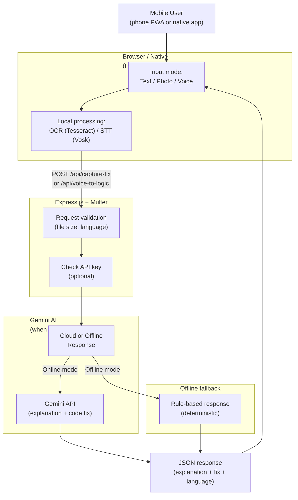

<div align="center">

# 🚀 RedLine

### *"Debug smarter, faster, anywhere — with AI-powered explanations and voice input."*

**iQOO Hackathon 2026 — City Battles**

[](#-live-demo--repository)
[](#-run-the-test-suite)
[](#license)
[](package.json)

</div>

---

## Overview

**RedLine** is a mobile-first debugging assistant that turns error screenshots, error text, or spoken descriptions into AI-powered explanations and code fixes — all from your phone.

No need to leave your mobile environment. Capture an error with your phone's camera, let **RedLine** extract the text via OCR, feed it to Google Gemini for reasoning, and get a human-readable explanation and a draft fix. Or describe a function in your voice, and RedLine generates code.

Built as a Progressive Web App (PWA) that works offline-first with local OCR and voice recognition, and as a backend API service deployable anywhere. Works with the browser demo, native Android apps, or any mobile shell.

---

## ✨ Key Features

**For Developers**
- 📸 **Screenshot-to-fix pipeline** — capture an error screenshot, extract text via Tesseract.js OCR, explain it with Gemini, get a code fix
- 🎤 **Voice input, offline STT** — describe what you want in your own words; Vosk offline speech recognition transcribes locally, no cloud dependency for STT
- ⌨️ **Type or paste** — text input for quick errors, chat-style interface
- 💾 **Offline-first PWA** — service worker caching, local fallback when Gemini is unavailable, works on cellular or WiFi
- 🌐 **Multi-language support** — request explanations in any language (English, Hindi, etc.), code generation in Python, JavaScript, Java, Go, and more
- 🔐 **Optional API key protection** — secure external API access with `X-Redline-API-Key` header

**Engineering Discipline**
- ✅ **Automated test suite** — coverage for health status, offline behavior, input validation, and screenshot handling
- 🧮 **Deterministic offline AI fallback** — when Gemini is unavailable, RedLine returns consistent, rule-based responses
- 📊 **Production-ready API** — request validation (Multer, Express), rate limiting, multipart file handling, and structured JSON responses
- 🚀 **One-click deployment** — Procfile for Railway, Heroku, Render, or any Node.js host

---

## 🌐 Live Demo & Repository

| | | |
|---|---|---|
| **Live artifact** | *Deployed on iQOO Hackathon platform* |
| **Source repository** | [github.com/ShamrithaGS/Redline](https://github.com/ShamrithaGS/Redline) |

---

## 🏗️ Architecture



### Component roles

| Component | File | Role |
|---|---|---|
| Frontend | `public/index.html` | Single-page PWA UI — no build step. Renders input modes (text / photo / voice), local OCR/STT, and displays explanations + fixes from live API responses. |
| Backend | `app.js` | Express.js service. Validates requests (Multer), handles file uploads, calls Gemini API (if configured), and serves `/api/*` endpoints and the frontend. |
| Voice Recognition | `public/vosk-worker.js` | Web Worker running Vosk (offline STT) — transcribes audio locally without cloud dependency. |
| Tests | `test/test.js` | Automated suite using Jest/Supertest — covers health, offline behavior, input validation, and API contracts. |

**What's live vs. precomputed:** everything is live. Every request to `/api/explain-fix`, `/api/capture-fix`, or `/api/voice-to-logic` either calls Gemini (if online) or returns a deterministic offline response. No animation, no pre-rendered results.

---

## 🚀 Getting Started

### Prerequisites
- Node.js 18+
- npm
- Google Gemini API key (optional, but required for full functionality)

### Installation

```bash
git clone https://github.com/ShamrithaGS/Redline.git
cd Redline

npm install
```

### Environment Setup

Create a `.env` file:

```env
GEMINI_API_KEY=<your-gemini-api-key>
GEMINI_MODEL=gemini-2.0-flash
ONLINE_MODE=true
REDLINE_API_KEY=<optional-api-key-for-external-clients>
PORT=8001
```

If `GEMINI_API_KEY` is not set, RedLine runs in offline mode with rule-based fallback responses.

### Run locally

```bash
npm start
```

Open **http://localhost:8001** in your browser or phone.

### Run the test suite

```bash
npm test
```

Expected: all tests pass. The suite covers:
- Health check endpoint
- Offline error explanation
- Code language selection
- Input validation
- Screenshot handling

---

## 📖 API Reference

| Method | Endpoint | Purpose |
|---|---|---|
| `GET` | `/` | Serves the frontend (`public/index.html`) |
| `GET` | `/api/health` | Health check — `{"status": "ok", "online_mode": true/false}` |
| `POST` | `/api/explain-fix` | Explain an error given error text |
| `POST` | `/api/capture-fix` | Capture and explain an error from a screenshot (OCR) |
| `POST` | `/api/voice-to-logic` | Convert a spoken description into code |
| `POST` | `/api/voice-input` | Transcribe spoken audio (requires offline STT model) |

**Example `/api/explain-fix` request:**
```json
{
  "errorText": "Uncaught TypeError: Cannot read property 'map' of undefined",
  "language": "English"
}
```

**Example response:**
```json
{
  "explanation": "The error occurs because you're trying to call `.map()` on a value that is `undefined`. This typically happens when...",
  "fix": "Check if the array exists before calling .map():\nif (array && Array.isArray(array)) {\n  array.map(...);\n}",
  "language": "English",
  "codeLanguage": "JavaScript"
}
```

All `/api/*` routes (except `/api/health`) require `X-Redline-API-Key` header if `REDLINE_API_KEY` is configured.

---

## 🎓 Who This Is For

**Audience:** mobile developers, QA engineers, and on-the-go debuggers who want fast, AI-powered explanations without leaving their phone or breaking their workflow.

**Use cases:**
- Capture a crash screenshot, get an instant explanation.
- Describe a feature requirement in your voice, get a code skeleton.
- Debug in production by taking a photo of an error message.
- Offline debugging with local OCR and voice transcription fallback.

**60-second test:** after opening RedLine, upload an error screenshot or type an error message, and you should get an explanation and a suggested fix within 5 seconds (if online).

---

## 🧪 Testing & Verification

The test suite covers:
- **Health & readiness** — API is up and reports correct online/offline status.
- **Offline behavior** — responses are deterministic when Gemini is unavailable.
- **Input validation** — rejects invalid file sizes, missing language codes, missing parameters.
- **Screenshot handling** — OCR pipeline works end-to-end.
- **Code language selection** — respects requested output language.

Run with:
```bash
npm test
```

Or run a single test file:
```bash
npm test -- test/test.js
```

---

## ☁️ Deployment

Deployed via:
- `Procfile` — `web: npm start`
- Environment variables: set `GEMINI_API_KEY`, `ONLINE_MODE`, and `PORT` on your hosting platform.

**Quick deploy to Railway / Heroku / Render:**

1. Connect your GitHub repo to your hosting platform.
2. Set environment variables in the platform's dashboard.
3. Deploy — the Procfile will automatically run `npm start`.

No Docker needed; the app runs directly on Node.js.

---

## 📚 Technology & Dependencies

- **Express.js** — HTTP framework
- **Multer** — file upload handling
- **Google Gemini API** — AI reasoning, explanation, code generation
- **Tesseract.js** — client-side OCR (browser)
- **Vosk** — offline speech-to-text (browser Web Worker)
- **Jest / Supertest** — testing framework

All dependencies are open-source and unmodified.

---

## 👥 Team

**Mohamed Jameen Ali M R** — [@jameen-ali](https://github.com/jameen-ali)

**Shamritha GS** — [@ShamrithaGS](https://github.com/ShamrithaGS)

**Nishu Kumari V** — [@Nishukumari09](https://github.com/Nishukumari09)

---

## 📄 Credits and Licenses

- **Express.js** (MIT), **Multer** (MIT), **Tesseract.js** (Apache-2.0), **Vosk** (Apache-2.0) — standard open-source dependencies, unmodified.
- All application code, API routes, frontend, and service worker were written for this project; no external code was copied in.

## License

This project is licensed under the MIT License.

---

## 🤖 AI Assistance Disclosure

This project was built with iterative assistance from AI agents:
- **Implementation:** Gemini 3.6 High (Google DeepMind) proposed initial implementations of the Express backend, the PWA frontend, and integration with Google Gemini API.
- **Independent review / research:** Claude (Anthropic) acted as an independent reviewer, verifying API contracts and testing end-to-end behavior.

<div align="center">

*Made for iQOO Hackathon 2026 — City Battles*

</div>
